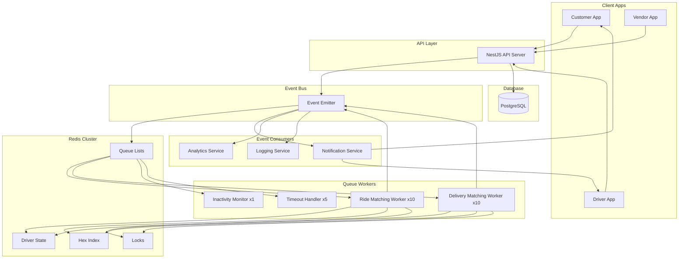
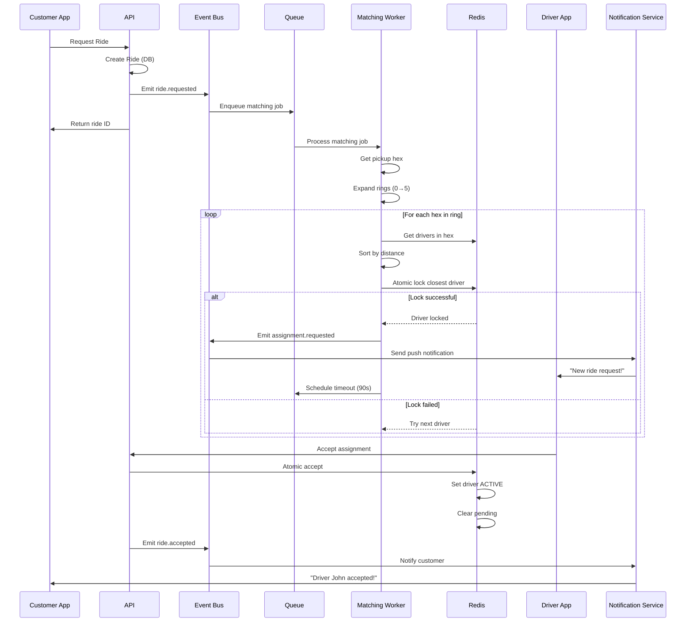
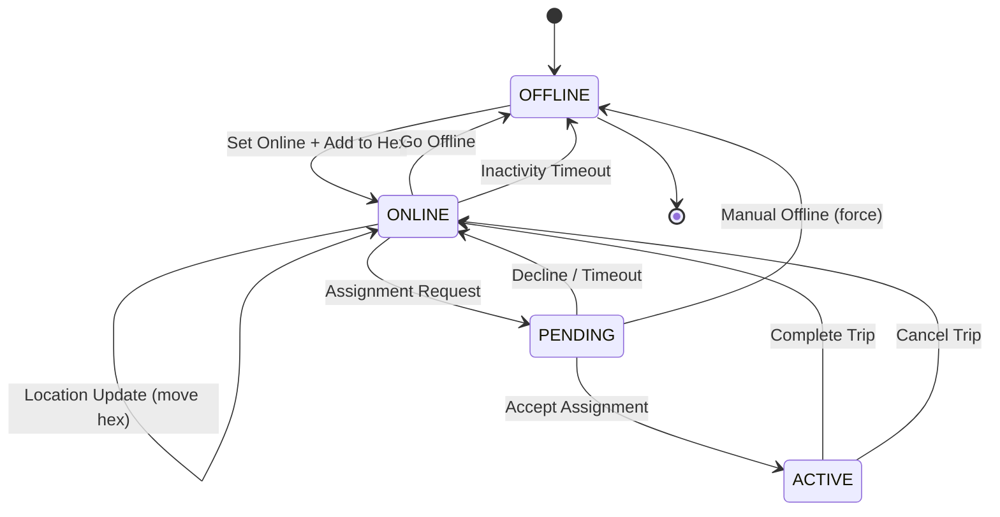
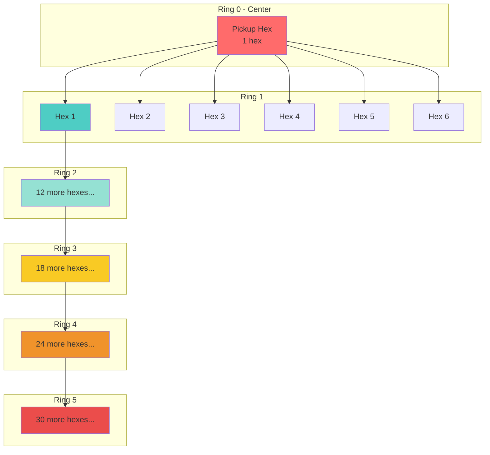
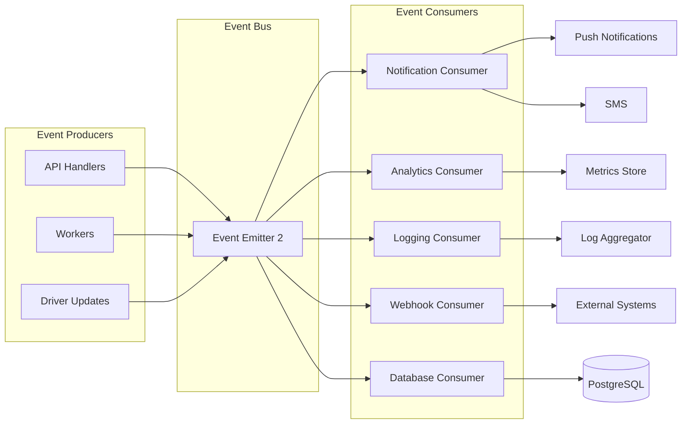
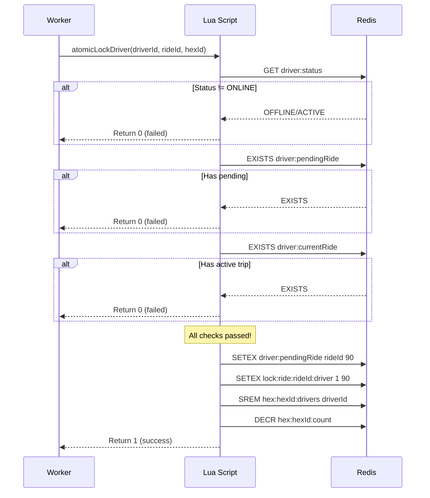
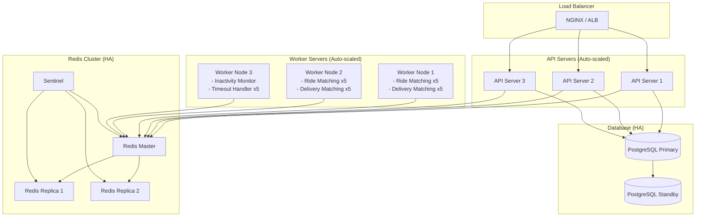
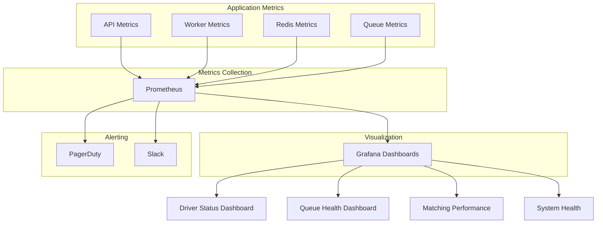

# System Architecture Diagrams

## High-Level Architecture

## Matching Algorithm Flow

## Redis State Machine

## Hex Ring Expansion

## Event-Driven Architecture

## Atomic Lock Flow (Lua Script)

## Deployment Architecture

## Monitoring Dashboard

